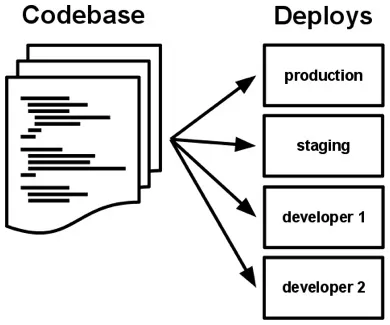
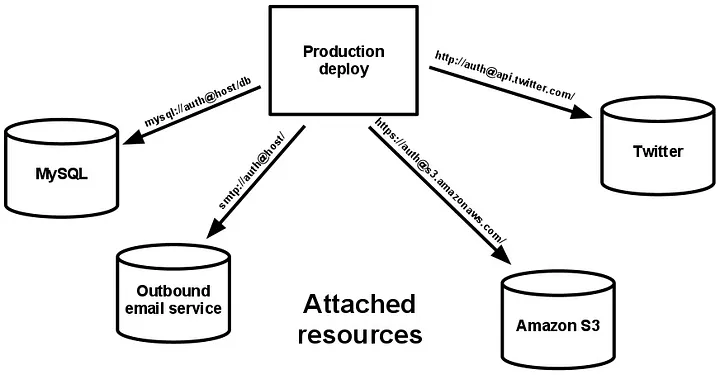
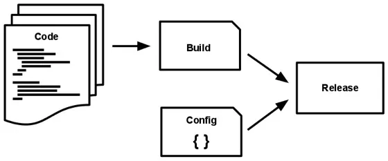
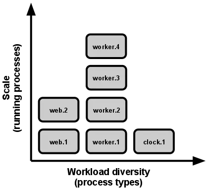
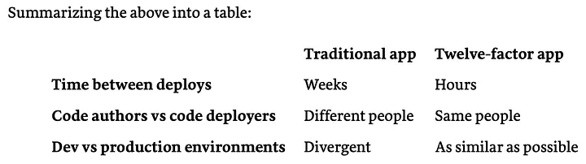

# 📚 The Twelve-Factor App สำหรับ Microservices

Twelve-Factor App คือชุดแนวทางออกแบบแอปพลิเคชันให้ **ขยายตัวง่าย ทำงานบน Cloud ได้ และเหมาะกับ Microservices**  

## สารบัญ
1. [Codebase](#1-codebase)
2. [Dependencies](#2-dependencies)
3. [Config](#3-config)
4. [Backing Services](#4-backing-services)
5. [Build, Release, Run](#5-build-release-run)
6. [Processes](#6-processes)
7. [Port Binding](#7-port-binding)
8. [Concurrency](#8-concurrency)
9. [Disposability](#9-disposability)
10. [Dev/Prod Parity](#10-devprod-parity)
11. [Logs](#11-logs)
12. [Admin Processes](#12-admin-processes)
13. [Reference](#13-reference)

---

## 1. Codebase

**แนวคิด:** แอปควรมี **codebase เดียว** แต่สามารถ deploy ไปหลาย environment ได้  

**แนวทางปฏิบัติ:**  
- เก็บ code ใน Git repository เดียว  
- ใช้ branch แยกการพัฒนาสำหรับแต่ละ environment  
- merge code บ่อย ๆ เพื่อป้องกันความแตกต่างระหว่าง environment  

**ข้อดี:**  
- ติดตามและควบคุมการเปลี่ยนแปลงง่าย  
- ลดความซับซ้อนในการจัดการ code  

---

## 2. Dependencies

**แนวคิด:** ระบุ dependencies **ทุกตัวอย่างชัดเจน** และแยกจาก code  

**แนวทางปฏิบัติ:**  
- ใช้ dependency manager (npm, pip, Maven)  
- ระบุเวอร์ชันของแต่ละ dependency  
- ใช้ Docker แยก environment ของแต่ละ service  

**ข้อดี:**  
- ลดปัญหาจาก dependency ที่เปลี่ยนเวอร์ชัน  
- พัฒนาและ deploy ราบรื่น  

---

## 3. Config

**แนวคิด:** configuration ควร **เก็บใน environment variables** แยกจาก code  

**แนวทางปฏิบัติ:**  
- เก็บค่าต่าง ๆ ของ environment ใน environment variables  
- ใช้ dotenv โหลด config ใน development  

**ข้อดี:**  
- เปลี่ยน config โดยไม่ต้องแก้ code  
- ปลอดภัย ไม่เปิดเผยข้อมูลสำคัญ  

---

## 4. Backing Services

**แนวคิด:** database, cache, queue เป็น **resources ที่สามารถเปลี่ยนได้**  

**แนวทางปฏิบัติ:**  
- เชื่อมต่อผ่าน URL หรือ connection string  
- เปลี่ยนหรืออัปเดต service โดยไม่แก้ code  

**ข้อดี:**  
- ยืดหยุ่นต่อการเปลี่ยน service  
- Testing และ development ง่ายขึ้น  

---

## 5. Build, Release, Run

**แนวคิด:** แยกขั้นตอน **Build → Release → Run**  

**แนวทางปฏิบัติ:**  
- ใช้ CI/CD pipeline  
- ทดสอบในแต่ละขั้นตอน  

**ข้อดี:**  
- ลดความซับซ้อนในการ deploy  
- เพิ่มความมั่นใจในคุณภาพ code  

---

## 6. Processes

**แนวคิด:** แอปควรทำงานแบบ **stateless process**  

**แนวทางปฏิบัติ:**  
- เก็บข้อมูลสำคัญใน backing services  
- แต่ละ process ทำงานอิสระ  

**ข้อดี:**  
- scale ง่าย  
- ลดความซับซ้อนในการจัดการ state  

---

## 7. Port Binding

**แนวคิด:** แอปต้องสามารถ **เปิด port ของตัวเอง** และรับ request  

**แนวทางปฏิบัติ:**  
- ใช้ HTTP server หรือ framework ที่สามารถ binding port  
- process รับ request ผ่าน port ได้โดยตรง  

**ข้อดี:**  
- เชื่อมต่อกับระบบอื่นง่าย  
- deploy ยืดหยุ่น  

---

## 8. Concurrency

**แนวคิด:** ใช้ **process model** เพื่อ scale งาน  

**แนวทางปฏิบัติ:**  
- ใช้ process pool หรือ worker pool  
- ปรับจำนวน process ตาม workload  

**ข้อดี:**  
- ประสิทธิภาพสูงขึ้น  
- scale แอปได้ง่าย  

---

## 9. Disposability

**แนวคิด:** แอปควร **start/stop รวดเร็ว**  

**แนวทางปฏิบัติ:**  
- process start/stop รวดเร็ว  
- จัดการ signal และ error อย่างเหมาะสม  

**ข้อดี:**  
- monitor ง่าย  
- ลด downtime ระหว่าง deploy  

---

## 10. Dev/Prod Parity

**แนวคิด:** Development, staging, production ควร **เหมือนกันมากที่สุด**  

**แนวทางปฏิบัติ:**  
- ใช้ Docker หรือ container จำลอง environment  
- ใช้ CI/CD pipeline ทดสอบและ deploy สม่ำเสมอ  

**ข้อดี:**  
- ลดปัญหาที่เกิดเฉพาะ environment  
- test และพัฒนาได้ง่าย  

---

## 11. Logs

**แนวคิด:** logs เป็น **stream ของ event** ไม่ควรเก็บเป็นไฟล์  

**แนวทางปฏิบัติ:**  
- เขียน logs ไป stdout/stderr  
- ใช้ ELK stack หรือ Prometheus monitor  

**ข้อดี:**  
- วิเคราะห์ง่าย  
- ลดความซับซ้อนจัดการ logs  

---

## 12. Admin Processes

**แนวคิด:** งาน admin เช่น database migration หรือ one-off task รัน **แยกจาก main app**  

**แนวทางปฏิบัติ:**  
- ใช้ command-line tools หรือ script  
- แยกจาก application process  

**ข้อดี:**  
- จัดการง่าย  
- test และ deploy ง่าย  

---

## 13. Reference
1. Adam Wiggins, *The Twelve-Factor App*, [https://12factor.net/](https://12factor.net/)  
2. Sakul Montha, *The Twelve-Factor App ในการทำ Microservices*, [Medium](https://iamgique.medium.com/the-twelve-factor-app-%E0%B9%83%E0%B8%99%E0%B8%81%E0%B8%B2%E0%B8%A3%E0%B8%97%E0%B8%B3-microservice-cfcd70fa106a)  
